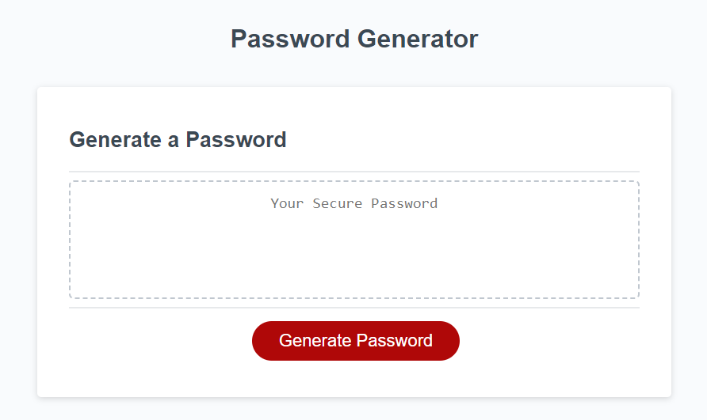
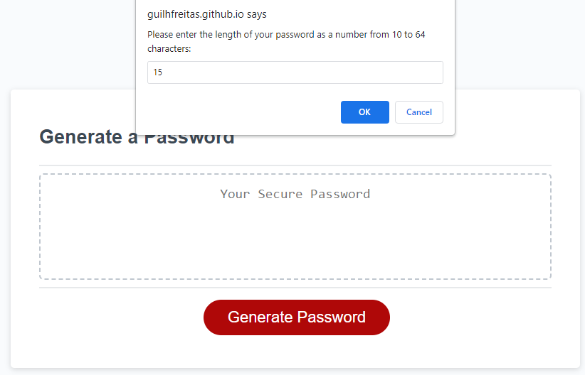
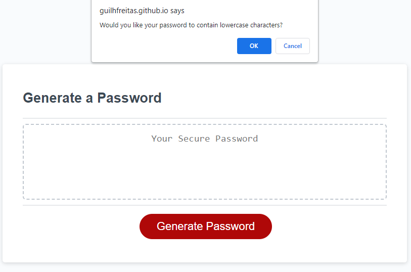
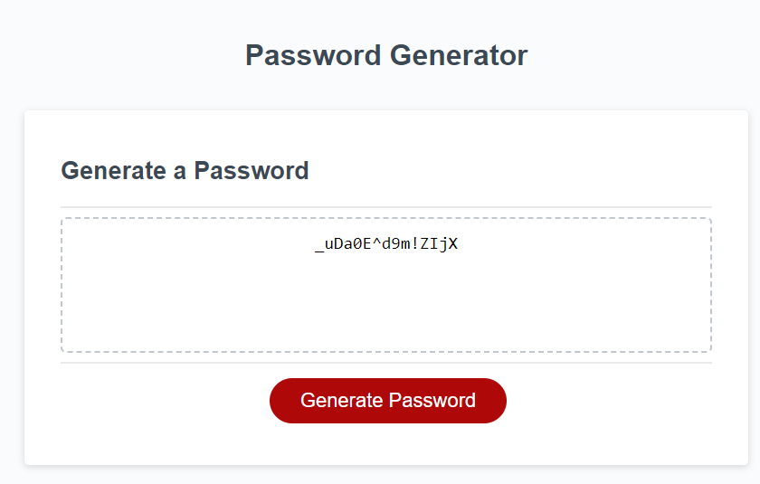

<!-- Improved compatibility of back to top link: See: https://github.com/othneildrew/Best-README-Template/pull/73 -->

<!--
*** Thanks for checking out the Best-README-Template. If you have a suggestion
*** that would make this better, please fork the repo and create a pull request
*** or simply open an issue with the tag "enhancement".
*** Don't forget to give the project a star!
*** Thanks again! Now go create something AMAZING! :D
-->
 

# Password Generator

<!-- ABOUT THE PROJECT -->
## About The Project

This is a password generator application. It runs in browser and generates a password that is between 10 and 64 characters long, giving the option of including or excluding all lowercase, uppercase, numeric and special characters from the generator.

## Installation

N/A

<!-- USAGE EXAMPLES -->
## Usage

Follow this link to the deployed page:

https://guilhfreitas.github.io/guilh-PassGenerator/

Simply click the "Generate Password" button to begin the process. Answer the all the prompts as they appear and the password will be generated and displayed in the text box.

<!-- ACKNOWLEDGMENTS -->
## Acknowledgments

* [Best README Template](https://github.com/othneildrew/Best-README-Template/pull/73)
* 
